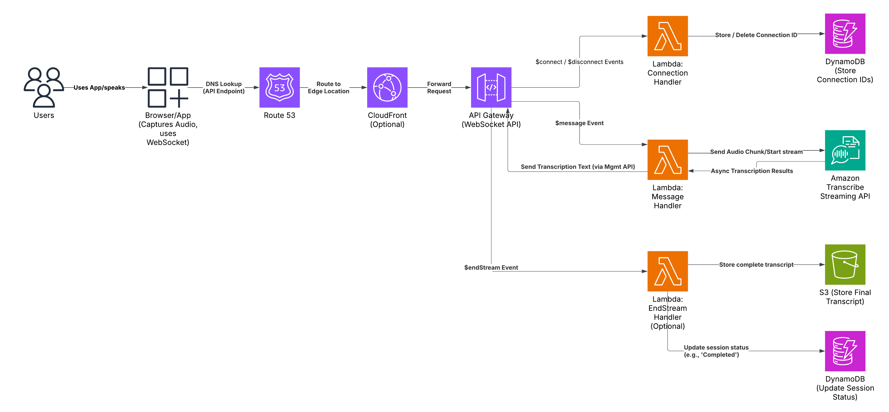

# System Design Diagrams

A curated collection of system design diagrams to aid in understanding various architectures.

## Table of Contents

| No. | System Name          | Description                         | Diagram Link |
|-----|----------------------|-------------------------------------|--------------|
| 1   | Real-time audio transcriptions   | Convert audio streams to text in real-time | [View Diagram](diagrams/real-time-audio-transcriptions.png) |
| 2   | Peer-to-Peer System  | Design of a decentralized network   | [View Diagram](diagrams/p2p-system.png)         |
| ... | ...                  | ...                                 | ...          |

## Detailed Descriptions

### Real-time audio transcriptions

  
Click to expand detailed description

  

  **Problem:**

  Users require immediate, low-latency conversion of live audio streams into text for interactive applications (e.g., live captioning, voice commands, meeting transcription). Traditional batch processing cannot provide the necessary real-time feedback. This solution offers a scalable, cloud-native way to handle many simultaneous audio streams for instant transcription.
  
  **Functional Requiremnets:**

  - Accept persistent WebSocket connections from clients.
  - Receive audio data chunks over established WebSocket connections.
  - Stream received audio chunks to Amazon Transcribe Streaming API.
  - Receive partial and final transcription results from Amazon Transcribe Streaming asynchronously.
  - Send partial and final transcription results back to the originating client via its WebSocket connection in near real-time.
  - Accept and handle specific "end stream" messages from clients to signal intentional completion.
  - Upon intentional completion, store the final, complete transcript persistently (e.g., in S3).
  - Track active WebSocket connections (e.g., storing Connection IDs in DynamoDB).
  - Update session status upon successful completion (e.g., in DynamoDB).
  - Clean up connection-specific resources (e.g., remove Connection ID from DynamoDB) upon client disconnection (both expected and unexpected).

  **Non-Functional Requirements:**

  - **Low Latency:** Transcription results should be returned to the client with minimal delay to maintain a real-time user experience.
  - **High Scalability:** The system must automatically scale to handle a large and fluctuating number of concurrent users and WebSocket connections.
  - **High Availability:** The service should be resilient to failures in individual components and remain operational.
  - **Cost-Effectiveness:** Leverage pay-per-use pricing models to minimize costs, especially during periods of low or no traffic.
  - **Reliability:** Ensure accurate transcription delivery and persistent storage of final transcripts.
  - **Maintainability:** The architecture should be modular and utilize managed services to reduce operational burden.
  - **Security:** Implement appropriate security measures for the WebSocket API endpoint and grant least privilege access via IAM roles.

  - **Compute (AWS Lambda vs. Containers - Fargate/ECS/EKS):**
    *   This architecture uses **AWS Lambda** for compute (handling WebSocket events and interacting with Transcribe/DynamoDB/S3).
    *   **Chosen For:** Direct/simple API Gateway integration, automatic fine-grained scaling, pay-per-use cost model, and lowest operational overhead.
    *   **Trade-off Accepted:** Potential for 'cold start' latency on initial invocation or during rapid scaling, mitigated partially by subsequent requests hitting warm instances. Containers (Fargate/ECS) would offer no cold starts (once running) but have higher idle costs, slower scaling initiation, increased operational complexity, and less direct API Gateway WebSocket integration.
  - **Session State/Metadata Database (Amazon DynamoDB vs. Amazon RDS):**
    *   This architecture uses **Amazon DynamoDB** for storing connection IDs and session status.
    *   **Chosen For:** Excellent scalability for high-volume key-value lookups/updates (getting/updating connection/session info), serverless operation (no instances to manage), flexible schema, and pay-per-request pricing aligns well with the event-driven nature.
    *   **Trade-off Accepted:** DynamoDB is less suited for complex relational queries or multi-item transactions compared to RDS. RDS was deemed overkill and operationally heavier for the simple state management required here.

## License

This project is licensed under the MIT License - see the [LICENSE](LICENSE) file for details.
